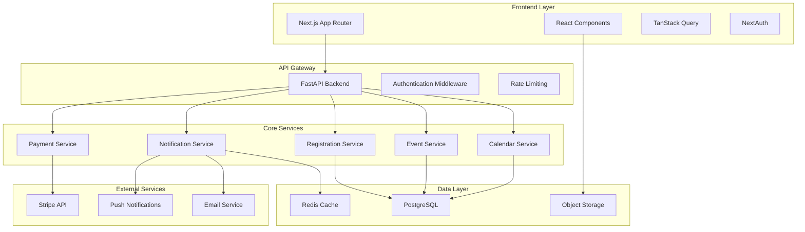

# Event Management Platform Design Document

## Overview

The Event Management Platform is a comprehensive calendar-based event organization system that enables users to create branded calendars, organize events, and build communities around shared interests. The platform follows a hierarchical structure where Calendars contain Events, and users can subscribe to Calendars to follow their favorite organizers.

The system is designed as a modern web application with a React/Next.js frontend and FastAPI backend, supporting real-time notifications, payment processing, and scalable event discovery. The architecture emphasizes user experience, community building, and monetization opportunities for event organizers.

## Architecture

### System Architecture

The platform follows a microservices-inspired architecture with clear separation of concerns:



### Technology Stack

**Frontend:**
- Next.js 14+ with App Router for server-side rendering and routing
- TypeScript for type safety
- Tailwind CSS + shadcn/ui for consistent design system
- TanStack Query for data fetching and caching
- NextAuth for authentication flows

**Backend:**
- FastAPI for high-performance REST API
- SQLAlchemy + Alembic for database ORM and migrations
- Pydantic for data validation and serialization
- Celery + Redis for background job processing

**Database & Storage:**
- PostgreSQL as primary database
- Redis for caching and session storage
- S3-compatible object storage for images and files

**External Integrations:**
- Stripe for payment processing
- SendGrid/Postmark for transactional emails
- Push notification services for real-time updates

## Components and Interfaces

### Core Domain Models

**User Management:**
- User profiles with authentication and authorization
- Role-based permissions (Platform Admin, Calendar Owner, Calendar Admin)
- Social media integration and public profiles

**Calendar System:**
- Calendar entities with branding, settings, and ownership
- Calendar subscriptions for community building
- Calendar Plus premium features and billing

**Event Management:**
- Event creation, editing, and publishing workflows
- Event discovery with search, filtering, and categorization
- Event registration with approval workflows and capacity management

**Notification System:**
- Multi-channel notification delivery (email, push, in-app)
- User preference management
- Event-driven notification triggers

### API Interface Design

**RESTful API Structure:**
```
/api/v1/
├── auth/                 # Authentication endpoints
├── users/               # User management
├── calendars/           # Calendar CRUD operations
├── events/              # Event management
├── registrations/       # Registration handling
├── notifications/       # Notification management
├── payments/           # Payment processing
├── discover/           # Discovery and search
└── settings/           # User preferences
```

**Key API Patterns:**
- Consistent JSON response format with metadata
- Pagination for list endpoints
- Filtering and sorting capabilities
- Proper HTTP status codes and error handling
- Rate limiting and authentication middleware

## Data Models

### Database Schema

**Users Table:**
```sql
users (
    id UUID PRIMARY KEY,
    email VARCHAR UNIQUE NOT NULL,
    password_hash VARCHAR,
    first_name VARCHAR,
    last_name VARCHAR,
    username VARCHAR UNIQUE,
    bio TEXT,
    avatar_url VARCHAR,
    social_links JSONB,
    joined_at TIMESTAMP,
    is_platform_admin BOOLEAN DEFAULT FALSE
)
```

**Calendars Table:**
```sql
calendars (
    id UUID PRIMARY KEY,
    owner_id UUID REFERENCES users(id),
    name VARCHAR NOT NULL,
    slug VARCHAR UNIQUE NOT NULL,
    description TEXT,
    visibility VARCHAR CHECK (visibility IN ('public', 'unlisted', 'private')),
    cover_image_url VARCHAR,
    timezone VARCHAR,
    is_plus_active BOOLEAN DEFAULT FALSE,
    stripe_customer_id VARCHAR,
    stripe_subscription_id VARCHAR,
    created_at TIMESTAMP,
    updated_at TIMESTAMP
)
```

**Events Table:**
```sql
events (
    id UUID PRIMARY KEY,
    calendar_id UUID REFERENCES calendars(id),
    host_user_id UUID REFERENCES users(id),
    title VARCHAR NOT NULL,
    description TEXT,
    cover_image_url VARCHAR,
    location_type VARCHAR CHECK (location_type IN ('offline', 'online', 'hybrid')),
    location_address TEXT,
    location_url VARCHAR,
    start_time TIMESTAMPTZ NOT NULL,
    end_time TIMESTAMPTZ NOT NULL,
    timezone VARCHAR,
    status VARCHAR CHECK (status IN ('draft', 'published', 'cancelled')),
    visibility VARCHAR CHECK (visibility IN ('public', 'unlisted', 'private')),
    capacity INTEGER,
    requires_approval BOOLEAN DEFAULT FALSE,
    ticket_type VARCHAR CHECK (ticket_type IN ('free', 'paid', 'donation')),
    ticket_price_cents INTEGER,
    currency VARCHAR(3),
    slug VARCHAR NOT NULL,
    category VARCHAR,
    is_featured BOOLEAN DEFAULT FALSE,
    created_at TIMESTAMP,
    updated_at TIMESTAMP,
    UNIQUE(calendar_id, slug)
)
```

**Registrations Table:**
```sql
event_registrations (
    id UUID PRIMARY KEY,
    event_id UUID REFERENCES events(id),
    user_id UUID REFERENCES users(id),
    email VARCHAR,
    name VARCHAR,
    status VARCHAR CHECK (status IN ('invited', 'pending_approval', 'confirmed', 'waitlisted', 'cancelled', 'declined', 'no_show')),
    ticket_quantity INTEGER DEFAULT 1,
    checkin_status VARCHAR CHECK (checkin_status IN ('not_checked_in', 'checked_in')),
    registration_source VARCHAR,
    payment_id UUID REFERENCES payments(id),
    created_at TIMESTAMP,
    updated_at TIMESTAMP
)
```

### Relationships and Constraints

- **One-to-Many:** Users → Calendars (ownership)
- **Many-to-Many:** Users ↔ Calendars (subscriptions, admin roles)
- **One-to-Many:** Calendars → Events
- **Many-to-Many:** Users ↔ Events (registrations)
- **One-to-Many:** Events → Payments (for paid tickets)

**Key Constraints:**
- Calendar slugs must be globally unique
- Event slugs must be unique within a calendar
- Registration capacity enforcement at application level
- Timezone validation using IANA timezone database
## Correctness Properties

*A property is a characteristic or behavior that should hold true across all valid executions of a system-essentially, a formal statement about what the system should do. Properties serve as the bridge between human-readable specifications and machine-verifiable correctness guarantees.*

### Event Management Properties

**Property 1: Event creation completeness**
*For any* valid event data (title, description, date, time, location), creating an event should result in all provided information being stored and retrievable
**Validates: Requirements 1.1**

**Property 2: Event publication visibility**
*For any* published event, the event should appear in discovery and search results for appropriate users
**Validates: Requirements 1.2**

**Property 3: Event image persistence**
*For any* uploaded event image, the image should be stored and retrievable when viewing the event
**Validates: Requirements 1.3**

**Property 4: Capacity enforcement**
*For any* event with a capacity limit, the number of confirmed registrations should never exceed the specified capacity
**Validates: Requirements 1.4**

**Property 5: Event update notification**
*For any* event update, all registered attendees should receive notifications about significant changes
**Validates: Requirements 1.5**

### Discovery and Search Properties

**Property 6: Search relevance**
*For any* keyword search, returned events should contain the search terms in their title, description, or metadata
**Validates: Requirements 2.1**

**Property 7: Date range filtering**
*For any* date range filter, returned events should have start times within the specified timeframe
**Validates: Requirements 2.2**

**Property 8: Location filtering**
*For any* location filter, returned events should be within the specified geographic area
**Validates: Requirements 2.3**

**Property 9: Category organization**
*For any* category filter, returned events should be tagged with the specified category
**Validates: Requirements 2.4, 11.1**

**Property 10: Event detail completeness**
*For any* event detail view, all required information (description, date, time, location, organizer) should be displayed
**Validates: Requirements 2.5**

### Registration Properties

**Property 11: Registration processing**
*For any* available event, successful registration should confirm attendance and update registration count
**Validates: Requirements 3.1**

**Property 12: Registration confirmation email**
*For any* successful registration, a confirmation email should be sent to the attendee
**Validates: Requirements 3.3**

**Property 13: Registration cancellation**
*For any* registration cancellation, the attendee should be removed from the list and capacity should be updated
**Validates: Requirements 3.4**

**Property 14: Personal event list**
*For any* user, their registered events list should contain all events they have confirmed registrations for
**Validates: Requirements 3.5**

### Event Management Properties

**Property 15: Registration visibility**
*For any* event organizer viewing their event, accurate registration count and attendee list should be displayed
**Validates: Requirements 4.1**

**Property 16: Attendee messaging**
*For any* message sent to event attendees, all registered participants should receive the communication
**Validates: Requirements 4.2**

**Property 17: Attendee data export**
*For any* attendee data export request, the downloaded file should contain complete attendee information
**Validates: Requirements 4.3**

**Property 18: Check-in processing**
*For any* attendee check-in, the attendance status should be updated and statistics should reflect the change
**Validates: Requirements 4.4**

**Property 19: Event cancellation workflow**
*For any* event cancellation, all registered attendees should be notified and refunds should be processed where applicable
**Validates: Requirements 4.5**

### Authentication and Profile Properties

**Property 20: Account creation security**
*For any* account creation, user credentials should be securely stored and a complete profile should be established
**Validates: Requirements 5.1**

**Property 21: Authentication success**
*For any* valid login credentials, the user should be authenticated and granted access to their account
**Validates: Requirements 5.2**

**Property 22: Profile update consistency**
*For any* profile information update, changes should be saved and reflected across all platform features
**Validates: Requirements 5.3, 13.1**

**Property 23: Event history accuracy**
*For any* user, their event history should contain all events they organized or attended
**Validates: Requirements 5.4**

**Property 24: Password reset security**
*For any* password reset request, a secure reset link should be sent and password update should be allowed
**Validates: Requirements 5.5**

### Payment Properties

**Property 25: Payment requirement enforcement**
*For any* paid event, payment processing should be required before registration confirmation
**Validates: Requirements 6.1**

**Property 26: Ticket issuance**
*For any* successful payment, a digital ticket should be issued and registration should be confirmed
**Validates: Requirements 6.2**

**Property 27: Refund processing**
*For any* refund request, payment should be processed and attendee status should be updated accordingly
**Validates: Requirements 6.4**

**Property 28: Revenue reporting accuracy**
*For any* revenue report, displayed ticket sales and payment analytics should reflect actual transaction data
**Validates: Requirements 6.5**

### Calendar Properties

**Property 29: Calendar creation completeness**
*For any* calendar creation, the calendar should be established with all specified branding and settings
**Validates: Requirements 7.1**

**Property 30: Calendar image display**
*For any* uploaded calendar cover image, the image should be displayed on the calendar profile
**Validates: Requirements 7.2**

**Property 31: Calendar visibility enforcement**
*For any* calendar visibility setting, access controls should be enforced according to the specified level
**Validates: Requirements 7.3**

**Property 32: Admin permission assignment**
*For any* admin permission assignment, the specified user should receive administrative access to the calendar
**Validates: Requirements 7.4**

**Property 33: Timezone consistency**
*For any* calendar timezone setting, all events should be displayed in the specified timezone
**Validates: Requirements 7.5**

### Subscription Properties

**Property 34: Calendar subscription processing**
*For any* public calendar subscription, the calendar should be added to the user's subscription list
**Validates: Requirements 8.1**

**Property 35: Subscriber notification**
*For any* new event published in a subscribed calendar, subscribers should be notified according to their preferences
**Validates: Requirements 8.2**

**Property 36: Unsubscription processing**
*For any* calendar unsubscription, the calendar should be removed from subscriptions and related notifications should stop
**Validates: Requirements 8.3**

**Property 37: Subscription list accuracy**
*For any* user's subscribed calendars view, all followed calendars with recent activity should be displayed
**Validates: Requirements 8.4**

**Property 38: Subscription metrics accuracy**
*For any* calendar owner viewing subscriber count, the displayed metrics should reflect actual subscription data
**Validates: Requirements 8.5**

### Notification Properties

**Property 39: Invitation delivery**
*For any* event invitation, the invitation should be delivered via the user's preferred notification channels
**Validates: Requirements 9.1**

**Property 40: Update notification broadcasting**
*For any* event update, all registered attendees should receive notifications about the changes
**Validates: Requirements 9.2**

**Property 41: Notification preference enforcement**
*For any* user notification preference setting, all future notifications should respect the specified settings
**Validates: Requirements 9.3, 13.3**

**Property 42: Approval notification**
*For any* registration requiring approval, the event host should be notified of the pending registration
**Validates: Requirements 9.4**

**Property 43: Reminder delivery**
*For any* scheduled event reminder, reminders should be sent to registered attendees at the appropriate times
**Validates: Requirements 9.5**

### Premium Features Properties

**Property 44: Plus feature activation**
*For any* Calendar Plus subscription, premium features should be enabled for the calendar
**Validates: Requirements 10.1**

**Property 45: Plus feature deactivation**
*For any* expired Calendar Plus subscription, premium features should be disabled while preserving existing data
**Validates: Requirements 10.2**

**Property 46: Recurring billing processing**
*For any* Calendar Plus subscription, recurring payments should be processed automatically
**Validates: Requirements 10.3**

**Property 47: Plus analytics access**
*For any* Calendar Plus subscriber, detailed calendar performance insights should be available
**Validates: Requirements 10.4**

**Property 48: Enhanced branding application**
*For any* Calendar Plus branding customization, enhanced options should be applied to the calendar
**Validates: Requirements 10.5**

### Discovery Properties

**Property 49: Popular event ranking**
*For any* popular events browse, events should be ranked by registration count and engagement metrics
**Validates: Requirements 11.2**

**Property 50: Calendar search results**
*For any* calendar search, returned calendars should match search criteria and display accurate subscriber counts
**Validates: Requirements 11.3**

**Property 51: Location-based discovery**
*For any* location filter in discovery, only events and calendars within the specified area should be shown
**Validates: Requirements 11.4**

**Property 52: Featured content display**
*For any* featured content view, curated events and calendars promoted by the platform should be displayed
**Validates: Requirements 11.5**

### Approval Workflow Properties

**Property 53: Approval requirement enforcement**
*For any* event with approval enabled, host approval should be required before registration confirmation
**Validates: Requirements 12.1**

**Property 54: Pending status assignment**
*For any* registration request for approval-required events, attendees should be placed in pending status
**Validates: Requirements 12.2**

**Property 55: Approval processing**
*For any* registration approval, the attendee should be confirmed and confirmation notifications should be sent
**Validates: Requirements 12.3**

**Property 56: Decline processing**
*For any* registration decline, the attendee should be notified and status should be maintained as declined
**Validates: Requirements 12.4**

### Privacy and Settings Properties

**Property 57: Privacy control enforcement**
*For any* privacy setting configuration, the specified controls should be enforced across all platform features
**Validates: Requirements 13.2**

**Property 58: Payment method security**
*For any* payment method management, payment information should be securely stored and processed
**Validates: Requirements 13.4**

**Property 59: Data export completeness**
*For any* user data export request, a comprehensive export of account information and activity should be provided
**Validates: Requirements 13.5**

## Error Handling

### Error Categories and Responses

**Validation Errors (400 Bad Request):**
- Invalid event dates (end time before start time)
- Missing required fields (event title, calendar ownership)
- Invalid timezone specifications
- Malformed email addresses or URLs

**Authentication Errors (401 Unauthorized):**
- Invalid or expired JWT tokens
- Failed login attempts
- Missing authentication headers

**Authorization Errors (403 Forbidden):**
- Insufficient permissions for calendar or event operations
- Attempting to access private calendars without permission
- Non-admin users trying to perform admin operations

**Resource Errors (404 Not Found):**
- Non-existent events, calendars, or users
- Invalid slugs or identifiers
- Deleted or cancelled events

**Conflict Errors (409 Conflict):**
- Duplicate calendar slugs
- Registration attempts for full events
- Concurrent modification conflicts

**Rate Limiting (429 Too Many Requests):**
- Exceeded API rate limits
- Too many registration attempts
- Bulk operation limits

**Server Errors (500 Internal Server Error):**
- Database connection failures
- External service unavailability (Stripe, email)
- Unexpected system errors

### Error Response Format

```json
{
  "error": {
    "code": "VALIDATION_ERROR",
    "message": "Event end time must be after start time",
    "details": {
      "field": "end_time",
      "provided": "2024-01-01T10:00:00Z",
      "start_time": "2024-01-01T14:00:00Z"
    },
    "timestamp": "2024-01-01T12:00:00Z",
    "request_id": "req_123456"
  }
}
```

### Graceful Degradation

**External Service Failures:**
- Email service down: Queue notifications for retry
- Payment service down: Allow free registrations, queue paid ones
- Image storage down: Use default images, queue uploads

**Database Performance Issues:**
- Implement read replicas for discovery queries
- Cache frequently accessed data in Redis
- Graceful timeout handling with user feedback

## Testing Strategy

### Dual Testing Approach

The testing strategy employs both unit testing and property-based testing to ensure comprehensive coverage and correctness validation.

**Unit Testing:**
- Specific examples demonstrating correct behavior
- Integration points between components
- Edge cases and error conditions
- API endpoint functionality
- Database operations and constraints

**Property-Based Testing:**
- Universal properties that should hold across all inputs
- Correctness properties defined in this design document
- Data integrity and consistency validation
- Business rule enforcement across various scenarios

### Property-Based Testing Implementation

**Testing Framework:** Hypothesis (Python) for backend property tests
**Test Configuration:** Minimum 100 iterations per property test
**Property Test Tagging:** Each property-based test must include a comment with the format:
`**Feature: event-management, Property {number}: {property_text}**`

**Key Property Test Areas:**
- Event creation and validation across all valid input combinations
- Registration workflows with various capacity and approval scenarios
- Calendar subscription and notification delivery patterns
- Payment processing with different pricing and refund scenarios
- Search and discovery functionality with diverse query patterns
- Permission and access control enforcement across user roles

### Integration Testing

**API Integration Tests:**
- End-to-end user workflows (registration, event creation, payment)
- External service integration (Stripe, email providers)
- Authentication and authorization flows
- Real-time notification delivery

**Database Integration Tests:**
- Data consistency across related entities
- Transaction handling and rollback scenarios
- Performance under concurrent operations
- Migration and schema evolution testing

### Performance Testing

**Load Testing Scenarios:**
- High-volume event discovery and search
- Concurrent registration attempts for popular events
- Bulk notification delivery
- Payment processing under load

**Performance Benchmarks:**
- API response times under 200ms for standard operations
- Search results returned within 500ms
- Email notifications delivered within 5 minutes
- Payment processing completed within 30 seconds