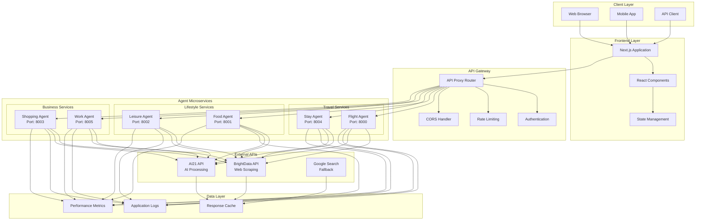
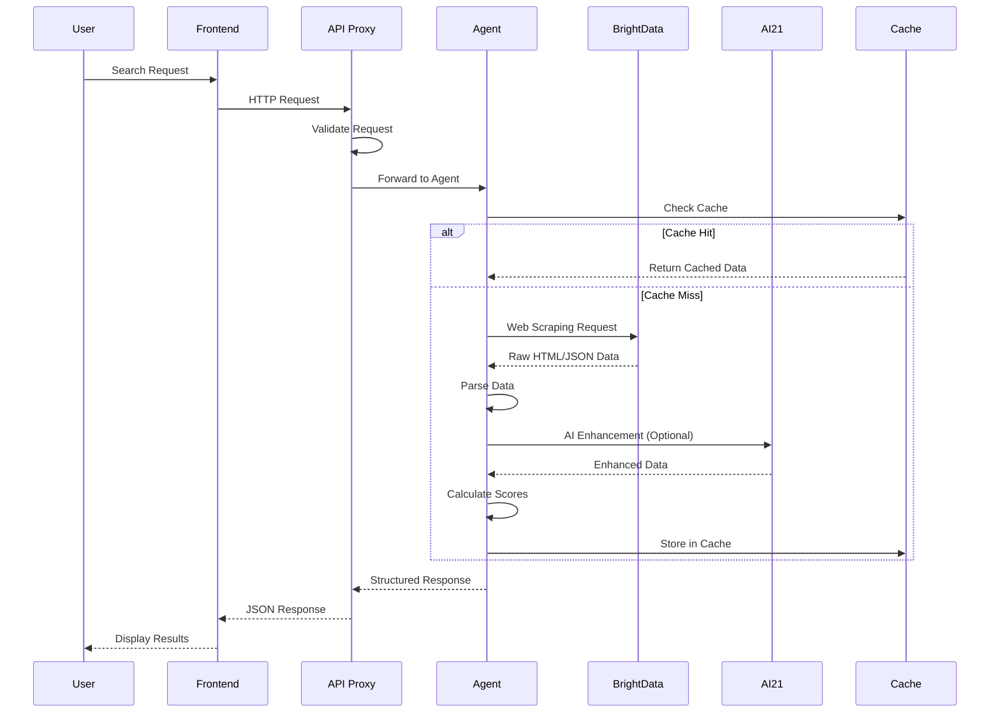
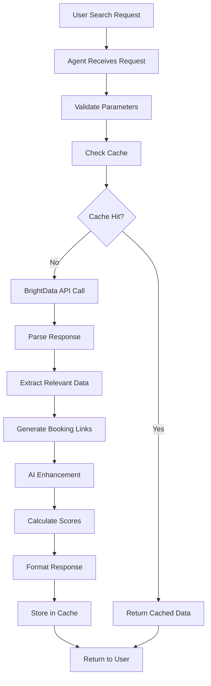
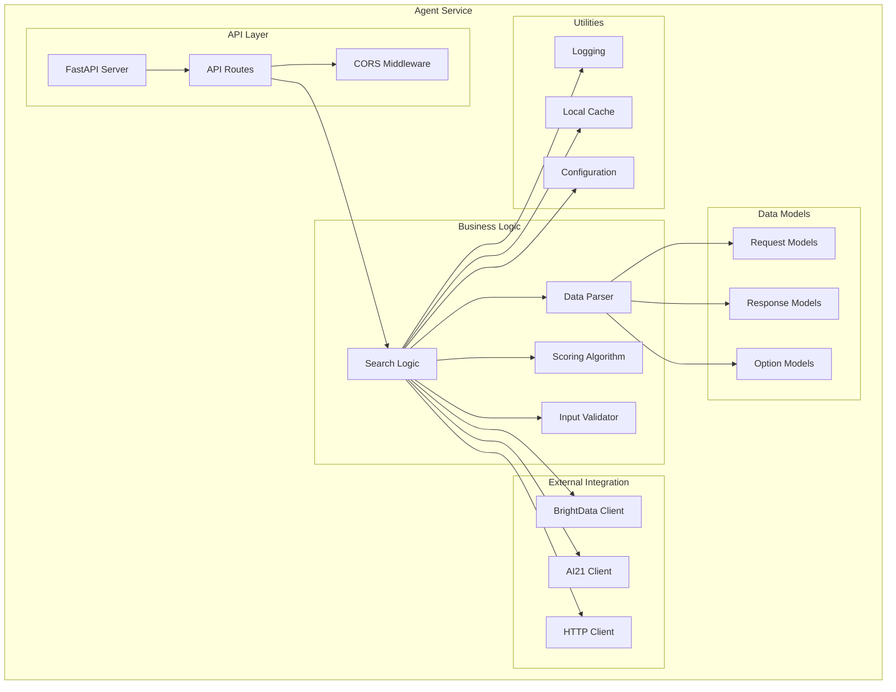
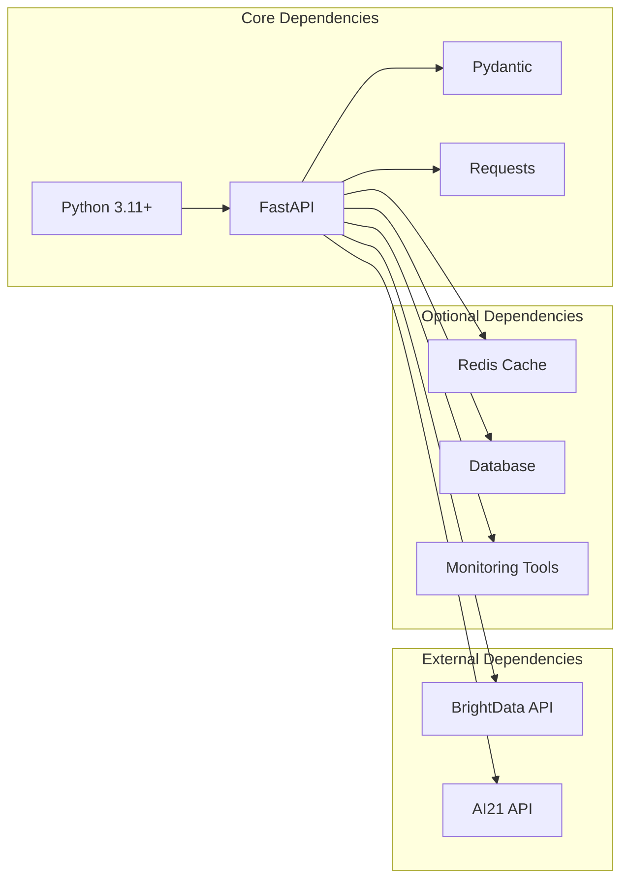
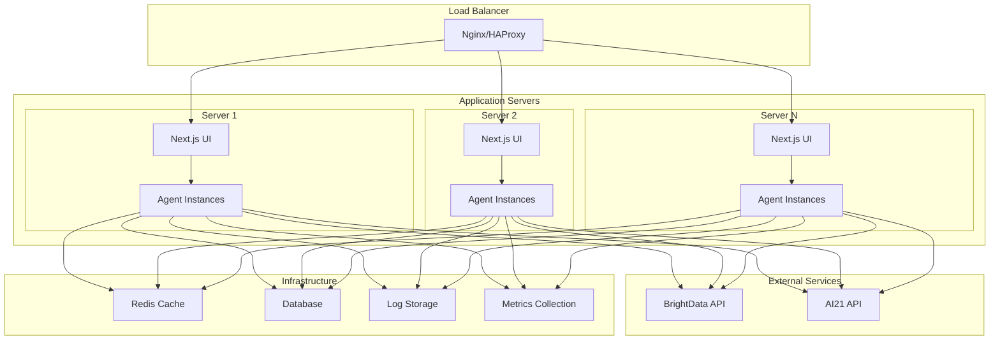
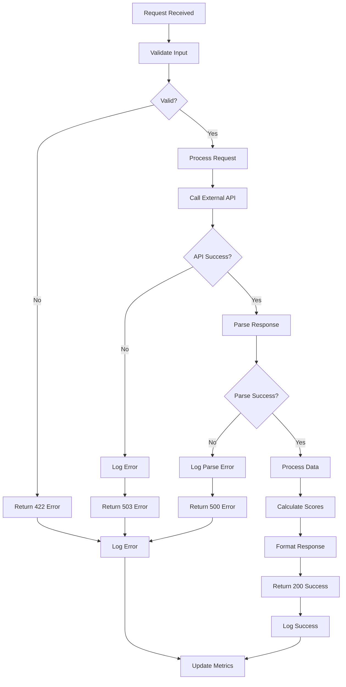

# Agent Architecture Diagram

## System Overview

## Agent Communication Flow

## Data Processing Pipeline

## Agent Internal Architecture

## Service Dependencies

## Deployment Architecture

## Error Handling Flow

This architecture diagram provides a comprehensive view of the Beacon Travel Agent system, showing the relationships between components, data flow, and deployment structure.
