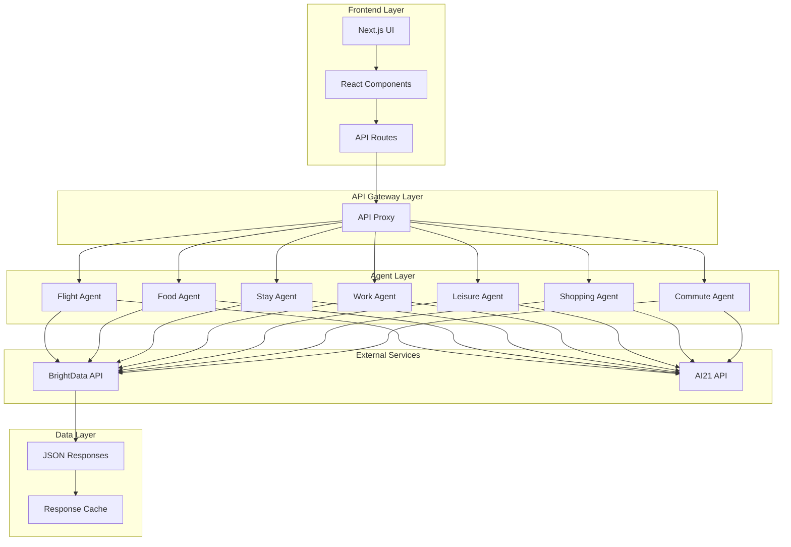
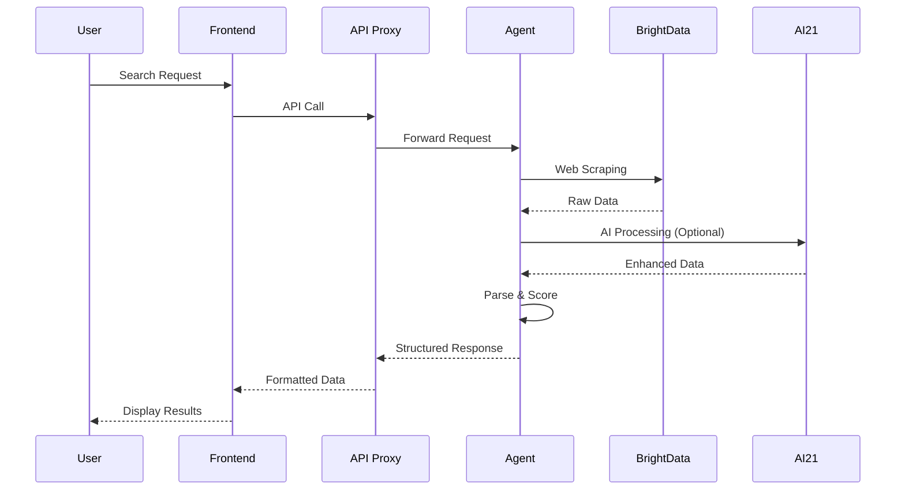
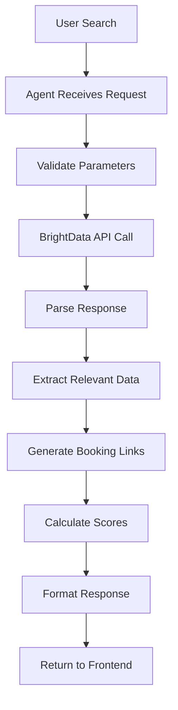

# Beacon Travel Agent - System Architecture

## Overview

The Beacon Travel Agent is a comprehensive travel planning platform that uses AI agents to provide real-time search and booking capabilities for various travel services. The system is built with a microservices architecture using FastAPI for backend agents and Next.js for the frontend interface.

## Current Status

### ✅ All Systems Operational
- **7 AI Agents**: All running and healthy on ports 8000-8006
- **Real Data Integration**: BrightData API for live web scraping
- **No Mock Data**: All agents use real-time data exclusively
- **Booking Integration**: Direct booking links for all services
- **UI**: Fully functional with all tabs working on port 3000

## System Architecture



## Core Components

### 1. Frontend Layer (Next.js)

**Location**: `ui/`

**Components**:
- **Main App** (`src/app/page.tsx`): Central hub with tabbed interface
- **Search Components**: Individual search interfaces for each service
- **Agent Status** (`src/components/AgentStatus.tsx`): Health monitoring dashboard
- **API Routes** (`src/app/api/`): Proxy endpoints for agent communication

**Key Features**:
- Responsive design with Tailwind CSS
- Real-time agent health monitoring
- Dynamic search interfaces
- Booking link integration

### 2. API Gateway Layer

**Location**: `ui/src/app/api/proxy/route.ts`

**Purpose**: Centralized routing and request forwarding to backend agents

**Features**:
- Request validation
- Response formatting
- Error handling
- CORS management

### 3. Agent Layer (Microservices)

Each agent is an independent FastAPI service with specific responsibilities:

#### Flight Agent (`agents/flight/`)
- **Port**: 8000
- **Purpose**: Flight search and booking
- **Data Sources**: BrightData API for flight information
- **Key Features**: Multi-airline search, price comparison, booking links
- **Status**: ✅ Healthy - Real-time data integration working

#### Food Agent (`agents/food/`)
- **Port**: 8001
- **Purpose**: Restaurant search and recommendations
- **Data Sources**: BrightData API for restaurant data
- **Key Features**: Cuisine filtering, rating system, booking integration
- **Status**: ✅ Healthy - UI fixed, displaying search results correctly

#### Stay Agent (`agents/stay/`)
- **Port**: 8004
- **Purpose**: Hotel and accommodation search
- **Data Sources**: BrightData API for hotel information
- **Key Features**: Price comparison, amenity filtering, booking links
- **Status**: ✅ Healthy - Real-time data integration working

#### Work Agent (`agents/work/`)
- **Port**: 8005
- **Purpose**: Coworking space search
- **Data Sources**: BrightData API for coworking data
- **Key Features**: Space type filtering, amenity matching, location-based search
- **Status**: ✅ Healthy - Dynamic location support implemented

#### Leisure Agent (`agents/leisure/`)
- **Port**: 8002
- **Purpose**: Activity and entertainment search
- **Data Sources**: BrightData API for activity data
- **Key Features**: Activity type filtering, duration matching, booking integration
- **Status**: ✅ Healthy - Real-time data integration working

#### Shopping Agent (`agents/shopping/`)
- **Port**: 8003
- **Purpose**: Product and shopping search
- **Data Sources**: BrightData API for product information
- **Key Features**: Category filtering, brand matching, purchase links
- **Status**: ✅ Healthy - Real-time data integration working

#### Commute Agent (`agents/commute/`)
- **Port**: 8006
- **Purpose**: Transportation and commute options search
- **Data Sources**: BrightData API for transportation data
- **Key Features**: Multi-mode transport search, real-time updates, booking integration
- **Status**: ✅ Healthy - Real-time data integration working

## Data Flow

### 1. User Request Flow



### 2. Agent Processing Pipeline



## Technology Stack

### Backend
- **Framework**: FastAPI
- **Language**: Python 3.11
- **Data Processing**: Pydantic models
- **Web Scraping**: BrightData API
- **AI Integration**: AI21 API
- **HTTP Client**: Requests library

### Frontend
- **Framework**: Next.js 14
- **Language**: TypeScript
- **Styling**: Tailwind CSS
- **State Management**: React hooks
- **HTTP Client**: Fetch API

### External Services
- **Web Scraping**: BrightData API
- **AI Processing**: AI21 API
- **Search Engine**: Google Search (via BrightData)

## Configuration

### Environment Variables

Each agent requires:
```bash
AI21_API_KEY=your_ai21_key
BRIGHTDATA_API_KEY=your_brightdata_key
```

### Port Configuration

| Service | Port | Purpose |
|---------|------|---------|
| UI | 3000 | Frontend interface |
| Flight Agent | 8000 | Flight search |
| Food Agent | 8001 | Restaurant search |
| Leisure Agent | 8002 | Activity search |
| Shopping Agent | 8003 | Product search |
| Stay Agent | 8004 | Hotel search |
| Work Agent | 8005 | Coworking search |
| Commute Agent | 8006 | Transportation search |

## Security Considerations

1. **API Key Management**: Environment variables for sensitive keys
2. **CORS Configuration**: Properly configured for cross-origin requests
3. **Input Validation**: Pydantic models for request validation
4. **Error Handling**: Graceful error responses without sensitive data exposure

## Scalability Features

1. **Microservices Architecture**: Independent scaling of each agent
2. **Stateless Design**: No shared state between requests
3. **Caching**: Response caching for improved performance
4. **Load Balancing**: Ready for horizontal scaling

## Monitoring and Health Checks

- **Agent Health**: Each agent exposes `/health` endpoint
- **Status Dashboard**: Real-time monitoring in UI
- **Error Tracking**: Comprehensive error logging
- **Performance Metrics**: Response time tracking

## Development Workflow

1. **Agent Development**: Independent development of each agent
2. **API Testing**: Direct agent testing via curl/Postman
3. **Integration Testing**: End-to-end testing via UI
4. **Deployment**: Individual agent deployment capability

## Future Enhancements

1. **Database Integration**: Persistent storage for user preferences
2. **Authentication**: User management and personalization
3. **Caching Layer**: Redis for improved performance
4. **Analytics**: Usage tracking and optimization
5. **Mobile App**: React Native mobile interface
6. **Real-time Updates**: WebSocket integration for live data
